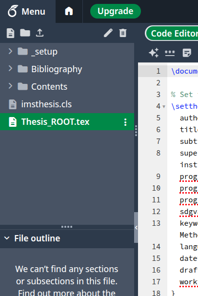
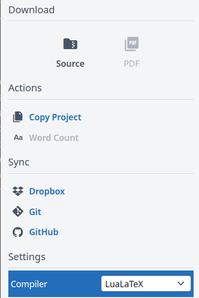

# Important Note About This Template

***This times out on Overleaf***

This LaTeX template was implemented to the best of my ability to be as close as possible to the given Word templates. There may be some differences; please consult your professors/supervisors in case there are any issues or discrepancies.

Some features are still to be implemented in future updates.

If you encounter any problems or have suggestions for improvements, please open an issue in the repository.

This was heavily inspired by the work of https://github.com/joaomlourenco/novathesis/ ; the file structure and organization is similar however the latex code itself was started from scratch.

## Usage Guidelines

Make sure you compile using `LuaLaTeX`:

Click on the Menu button on Overleaf:



Select LuaLaTeX:




### Important - What to Modify

1. **DO modify** the content files in the `Contents/` directory
   - This is where your actual thesis content should go
   - Each section should be placed in the appropriate file as shown in the directory structure

2. **DO set** the thesis options in `Thesis_ROOT.tex` as shown in the "Setting Thesis Options" section
   - This configures your thesis metadata (author, title, etc.)

### Important - What NOT to Modify

1. **DO NOT modify** the following template files:
   - `imsthesis.cls` - The class file defining the document structure
   - Any `.sty` files in the `_setup/` directory
   - These files control the formatting and functionality of the template

2. **DO NOT modify** the structure of `Thesis_ROOT.tex` beyond setting the options
   - Unless you have advanced LaTeX knowledge and understand the consequences

Modifying template files may break functionality, cause compilation errors, or result in a document that doesn't comply with institutional requirements. If you need to make advanced customizations, consider creating a local style file that you can load after the template.

# Nova IMS Thesis Template

A LaTeX template for thesis/dissertation documents at NOVA Information Management School (IMS).

## Overview

This template provides a standardized format for academic works at NOVA IMS, including master theses, doctoral dissertations, and other academic reports. The template handles formatting, structure, and styling according to NOVA IMS guidelines.

## Files Structure

- `Thesis_ROOT.tex` - Main document file that structures the content
- `imsthesis.cls` - Class file that defines the document structure
- `_setup/imsoptions.sty` - Package that manages document options and metadata
- `_setup/imsstyles.sty` - Defines styles for the document
- `_setup/imscommands.sty` - Contains utility commands
- `_setup/imspages.sty` - Defines page layouts and special pages

## Quick Start

1. Edit `Thesis_ROOT.tex` to set your thesis options
2. Write your content in the respective chapters in the `Contents/` folder
3. Compile the document using LuaLaTeX

## Setting Thesis Options

The template uses a key-value system for document options. Set these in the main file:

```latex
\documentclass{imsthesis}

\setthesisoptions{
  author={Your Full Name},
  title={Your Thesis Title},
  subtitle={Optional Subtitle},
  supervisor={Supervisor's Name, Title (PhD), Affiliation},
  programacronym={MDSAA},
  programfullname={Data Science and Advanced Analytics},
  programspecialization={Business Analytics},
  sdgvalues={4,9,13},
  keywords={Keyword 1; Keyword 2; Keyword 3},
  language={EN},
  date={15-06-2025},
  draft=true,
  worktype={Master Thesis}
}
```

## Available Options

| Option | Description | Default Value |
|--------|-------------|---------------|
| `author` | Your full name | "Author Name" |
| `title` | Thesis title | "Paper Title" |
| `subtitle` | Optional subtitle | "" (empty) |
| `supervisor` | Supervisor info including credentials | "Supervisor Name" |
| `programacronym` | Program acronym (e.g., MDSAA, MGI) | "MDSAA" |
| `programfullname` | Full program name | "Data Science and Advanced Analytics" |
| `programspecialization` | Specialization (if applicable) | "" (empty) |
| `sdgvalues` | UN Sustainable Development Goals numbers (1-17) | "" (empty) |
| `keywords` | Keywords for your thesis (semicolon separated) | "" (empty) |
| `language` | Document language: EN or PT | "EN" |
| `date` | Submission date (DD-MM-YYYY) | \today |
| `draft` | Draft mode (true/false) | true |
| `worktype` | Type of work | "Master Thesis" |

## Document Structure

The template follows a standard academic document structure:

```
frontmatter
  - Title page
  - Abstract
  - Acknowledgments
  - Table of contents
  
mainmatter
  - Introduction
  - Literature Review
  - Methodology
  - Results
  - Discussion
  - Conclusion
  
backmatter
  - References
  - Appendices
```

### Directory Structure

The template is organized with the following directory structure:

```
Contents/
├── 0_FrontChapters.tex
├── 1_MainChapters.tex
├── 2_BackChapters.tex
└── Chapters
    ├── 0_Frontmatter
    │   ├── 0_Glossaries.tex
    │   ├── 1_Statement_Integrity.tex
    │   ├── 2_Dedication.tex
    │   ├── 3_Acknowledgements.tex
    │   └── 4_Abstract.tex
    ├── 1_Main
    │   ├── 1_Introduction.tex
    │   ├── 2_Literature_Review.tex
    │   ├── 3_Methodology.tex
    │   ├── 4_Results_Discussion.tex
    │   ├── 5_Conclusions.tex
    │   ├── 6_Limitations.tex
    │   └── figures
    │       └── nova-ims-logo.png
    └── 2_Backmatter
        └── Appendix_A.tex
```

Each section of your thesis should be placed in the appropriate file within this structure. The main chapters files (`0_FrontChapters.tex`, `1_MainChapters.tex`, and `2_BackChapters.tex`) input the individual chapter files from their respective directories.

## Special Commands

| Command | Description |
|---------|-------------|
| `\imspagecover` | Generates the cover page |
| `\imspagetitle` | Generates the title page |
| `\imspagefront` | Generates frontmatter pages |
| `\imspagekeyws` | Displays keywords and SDG icons |
| `\imspagebegin` | Marks the beginning of content |
| `\imspageback` | Generates backmatter pages |

## Optimization for Overleaf

To improve compilation performance on Overleaf:

1. Use selective compilation during development:
   ```latex
   \includeonly{Contents/chapter-you-are-working-on}
   ```

2. Set manual compilation in Overleaf settings rather than automatic

3. Consider using draft mode for graphics during development:
   ```latex
   \usepackage[draft]{graphicx}
   ```

## UN Sustainable Development Goals

The template can display icons for the UN Sustainable Development Goals relevant to your work. Specify them using the `sdgvalues` option with numbers from 1-17.

Example: `sdgvalues={4,9,13}` will display icons for:
- Goal 4: Quality Education
- Goal 9: Industry, Innovation and Infrastructure
- Goal 13: Climate Action

## Language Support

The template supports both English (EN) and Portuguese (PT). Set the language option to switch between these. The language affects auto-generated text throughout the document.

## Tips for Use

1. **Development Mode**: Keep `draft=true` during development for faster compilation
2. **Bibliography**: Add your references to `.bib` files in the Bibliography folder
3. **Chapter Structure**: Organize your chapters in separate files in the Contents folder
4. **Selective Compilation**: Use `\includeonly` to compile only chapters you're working on
5. **Precompiled Preamble**: On Overleaf Pro, use the precompiled preamble feature for faster compilation

## License

This template is licensed under the LaTeX Project Public License (LPPL) version 1.3c. The LPPL is the standard license used by most LaTeX packages and templates, including those in the core LaTeX distribution.

### What the LPPL Means for Users

- You can **use** this template freely for any purpose, including commercial use
- You can **distribute** unmodified copies of this template
- You can **modify** the template for your own use
- If you **distribute modified versions**, you must:
  - Clearly identify your modifications
  - Include information on how to obtain the original version
  - Use a different name to avoid confusion with the original template

See the [LICENSE](LICENSE) file for complete license details.

